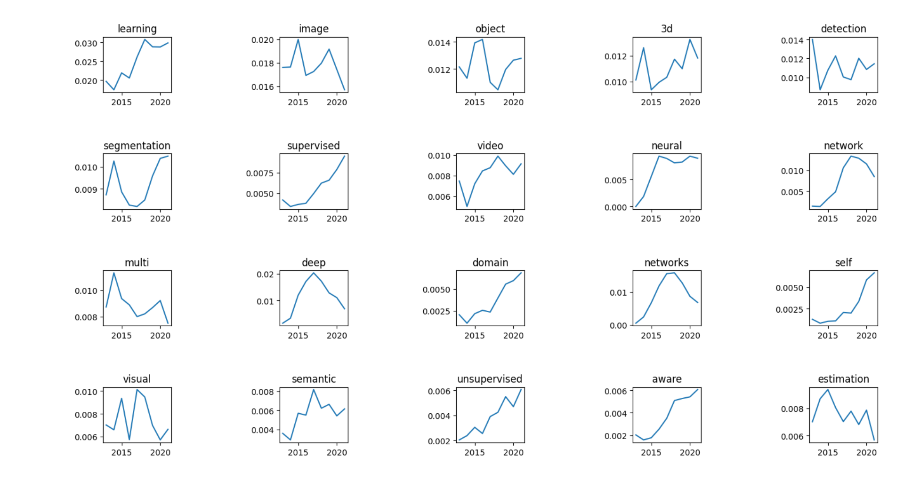

**trends_of_cv** crawls the data from the web, analyzes the frequency of the title words in top computer vision research (CVPR+ICCV), and illustrates the trends of the hot words. The trends of any word of your interest can be got in the trends dict in step2_analyze.py.

